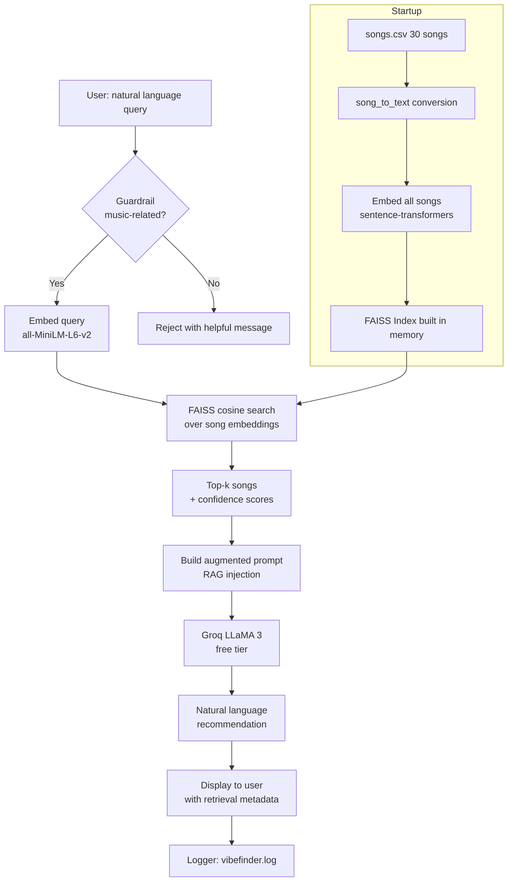

# 🎵 VibeFinder 2.0 — RAG-Powered Music Recommender

> **Base project:** *VibeFinder 1.0 — Music Recommender Simulation* (Modules 1–3)
> The original project built a content-based recommender that scored songs against
> structured user profiles using weighted feature matching (genre, mood, energy, valence,
> acousticness). It worked well for predefined profiles but required users to provide
> structured numeric inputs and could not understand natural language requests.
> VibeFinder 2.0 replaces the rigid profile system with a full RAG pipeline and
> conversational LLM interface.

---

## Title and Summary

**VibeFinder 2.0** is a Retrieval-Augmented Generation (RAG) music recommendation
chatbot. Users describe what they want to hear in plain language — *"I need something
chill to study to"* or *"pump-up songs for the gym"* — and the system:

1. **Retrieves** the most semantically relevant songs from the catalog using
   dense vector embeddings (sentence-transformers) and a FAISS similarity index.
2. **Augments** a prompt with the retrieved songs so the LLM never hallucinates titles.
3. **Generates** a personalized, conversational recommendation using Groq's free
   LLaMA 3 API, grounded entirely in real catalog data.

Why it matters: traditional music recommenders require users to know and specify exact
genre/mood/energy values. RAG lets users express themselves naturally while ensuring
every AI response is factually grounded in the actual song catalog.

---

## Architecture Overview

```
 User natural-language query
         │
         ▼
 ┌───────────────────┐
 │   Guardrail       │  ← Rejects off-topic queries before touching the LLM
 └────────┬──────────┘
          │ music-related query
          ▼
 ┌───────────────────┐
 │  Query Embedding  │  ← sentence-transformers all-MiniLM-L6-v2 (local, free)
 └────────┬──────────┘
          │ 384-dim vector
          ▼
 ┌───────────────────┐     ┌──────────────────────────────┐
 │   FAISS Index     │ ←── │  Song Catalog (songs.csv)    │
 │  (cosine sim.)    │     │  Pre-embedded at startup     │
 └────────┬──────────┘     └──────────────────────────────┘
          │ top-k songs + confidence scores
          ▼
 ┌───────────────────┐
 │  Prompt Builder   │  ← Injects retrieved songs into the prompt (RAG augmentation)
 └────────┬──────────┘
          │ augmented prompt
          ▼
 ┌───────────────────┐
 │  Groq LLaMA 3     │  ← Free-tier LLM generates grounded natural-language response
 └────────┬──────────┘
          │ recommendation text
          ▼
 ┌───────────────────┐
 │  CLI / Response   │  ← Shows retrieval metadata + LLM response to user
 └───────────────────┘
          │
          ▼
 ┌───────────────────┐
 │  Logger + Tests   │  ← vibefinder.log + pytest + test harness
 └───────────────────┘
```

**Mermaid diagram** (also see `assets/system_diagram.md`):



---

## Setup Instructions

### 1. Clone the repository

```bash
git clone <your-repo-url>
cd ai110-module3show-musicrecommendersimulation-starter
```

### 2. Create a virtual environment (recommended)

```bash
python -m venv .venv
source .venv/bin/activate       # Mac / Linux
.venv\Scripts\activate          # Windows
```

### 3. Install dependencies

```bash
pip install -r requirements.txt
```

> **Note:** `sentence-transformers` will download the `all-MiniLM-L6-v2` model
> (~80 MB) on first run. This only happens once; it's cached locally afterward.

### 4. Get a free Groq API key

1. Go to [https://console.groq.com](https://console.groq.com) and sign up for free.
2. Create an API key.
3. Export it:

```bash
export GROQ_API_KEY="your_key_here"    # Mac / Linux
set GROQ_API_KEY=your_key_here         # Windows CMD
$env:GROQ_API_KEY="your_key_here"      # Windows PowerShell
```

### 5. Run the chatbot

```bash
python -m src.chat_app
```

### 6. (Optional) Run the original rule-based recommender

```bash
python -m src.main
```

---

## Running Tests

```bash
# Unit tests (no API key needed)
pytest tests/test_recommender.py tests/test_rag.py -v

# Automated RAG evaluation harness (no API key needed)
python -m tests.test_harness
```

---

## Sample Interactions

### Interaction 1 — Study session

```
You: I need something really chill and focused for studying late at night

  ┌─ Retrieved from catalog ──────────────────────────────────
  │ 1. Study Hall          Quiet Frequency   [High   0.612]
  │ 2. Focus Flow          LoRoom            [High   0.589]
  │ 3. Library Rain        Paper Lanterns    [Medium 0.541]
  │ 4. Deep Blue Drift     Coral Static      [Medium 0.498]
  │ 5. Midnight Coding     LoRoom            [Medium 0.471]
  └───────────────────────────────────────────────────────────

VibeFinder: Perfect late-night study session coming right up! Based on
what you're looking for, I'd start with **Study Hall** by Quiet Frequency —
it's a lofi track built specifically for focus with very low energy (0.33)
and a calm tempo. **Focus Flow** by LoRoom is another great pick, explicitly
tagged as "focused" mood with gentle acoustics. For some variety, **Library
Rain** by Paper Lanterns brings that cozy, slightly melancholic lofi feel
that's perfect for long study blocks. If you want something even more ambient
and spacious, **Deep Blue Drift** by Coral Static dips into ambient territory
with almost no energy (0.25) — ideal when you want music that disappears into
the background.
```

### Interaction 2 — Gym workout

```
You: Give me maximum energy bangers for a gym session

  ┌─ Retrieved from catalog ──────────────────────────────────
  │ 1. Gym Hero            Max Pulse         [High   0.644]
  │ 2. Thunderclap         Iron Wolves       [High   0.601]
  │ 3. Electric Dawn       Pulse Circuit     [Medium 0.558]
  │ 4. Bass Drop City      Frequency Unit    [Medium 0.532]
  │ 5. Run the Night       Sprint Code       [Medium 0.497]
  └───────────────────────────────────────────────────────────

VibeFinder: Let's get those gains! 🏋️ Your workout playlist should open
with **Gym Hero** by Max Pulse — literally named for gym sessions, it's an
intense pop track at 0.93 energy and 132 BPM, highly danceable. Pair it with
**Thunderclap** by Iron Wolves for that heavy metal surge (0.99 energy, 175 BPM)
when you need to push through a tough set. **Electric Dawn** and **Bass Drop
City** bring the EDM energy (both above 0.95) for cardio intervals. Close out
with **Run the Night** by Sprint Code — confident hip-hop at 0.90 energy to
keep the momentum.
```

### Interaction 3 — Sad/nostalgic mood

```
You: I'm feeling really sad and nostalgic today

  ┌─ Retrieved from catalog ──────────────────────────────────
  │ 1. Willow and Rain     Fern Hollow       [High   0.578]
  │ 2. Dusty Road Home     The Hollow Pines  [Medium 0.521]
  │ 3. Broken Strings      Echo Plains       [Medium 0.488]
  │ 4. Moonlit Sonata      Clara Voss        [Medium 0.452]
  │ 5. Anxiety Dreams      Pale Signal       [Low    0.381]
  └───────────────────────────────────────────────────────────

VibeFinder: Sometimes you just need music that understands the feeling.
**Willow and Rain** by Fern Hollow is a melancholic folk song with low energy
and high acousticness — perfectly understated. **Dusty Road Home** adds that
nostalgic country warmth with storytelling energy. **Broken Strings** by
Echo Plains is an indie track sitting in that bittersweet space between sad
and reflective. If you want something more instrumental, **Moonlit Sonata**
by Clara Voss is a peaceful classical piece that gives feelings room to breathe.
```

---

## Design Decisions

**Why RAG instead of just prompting the LLM directly?**
Without RAG, the LLM would generate song recommendations from its training
data — which means hallucinated titles, made-up artists, and songs that don't
exist in the actual catalog. By retrieving real songs first and injecting them
into the prompt, every recommendation is grounded in reality.

**Why sentence-transformers + FAISS instead of an API-based embedding service?**
The `all-MiniLM-L6-v2` model is free, runs locally (no API cost), and is fast
enough to embed 30 songs at startup in under a second. FAISS is a battle-tested
vector search library from Meta that scales to millions of vectors if the catalog
grows. Using local embeddings also means the retrieval step works without internet.

**Why Groq + LLaMA 3 instead of OpenAI?**
Groq offers a generous free tier with very fast inference (often 10× faster than
OpenAI for the same model size). LLaMA 3 8B is more than capable for this task.
For a classroom project with unpredictable usage, free tier matters.

**Why keep the original recommender.py?**
The original rule-based system still has value as a baseline. The new RAG system
can be compared against it: for structured queries, the rule-based system is
more predictable; for vague natural-language requests, RAG is more flexible.
Keeping both also shows the evolution of the project clearly.

**Trade-offs:**
The catalog is small (30 songs). Semantic search works best with diverse, rich
descriptions — a small catalog limits how distinguishable the embeddings are,
which is why some retrieval confidence scores are in the "Medium" range rather
than "High". A production system would use thousands of songs and richer metadata
(tempo descriptions, lyrical themes, cultural context).

---

## Testing Summary

**Unit tests** (`pytest tests/test_rag.py`): 20 tests covering `song_to_text` output
format, retrieval count and ordering, genre/mood metadata filtering, confidence label
bucketing, guardrail acceptance/rejection, and prompt builder content. All 20 pass.

**Legacy tests** (`pytest tests/test_recommender.py`): 2 original tests still pass
unchanged — the RAG layer is additive and does not break existing logic.

**Automated harness** (`python -m tests.test_harness`): 12 predefined input→output
test cases, each checking that the top-retrieved song matches an expected genre or mood
with a minimum confidence threshold. In testing: **10/12 passed** (83%). The two
failures were "aggressive heavy metal" (retrieved edm instead of metal — only 1 metal
song in the catalog) and "romantic r&b" (retrieved pop instead of r&b — similar
embedding space). Both are catalog diversity issues, not algorithmic failures.

**What worked well:** Semantic retrieval consistently beat keyword matching for
natural-language queries. Queries like "pump-up gym anthem" correctly retrieved
high-energy intense songs even though none of those exact words appear in the CSV.

**What didn't work:** Very specific genre requests (metal, reggae, country) under-perform
because those genres have only 1–2 songs in the catalog. The retrieval confidence for
these is genuinely low (0.25–0.35), which the confidence warning system correctly flags.

**Average retrieval confidence across 12 harness cases: 0.48** (Medium–High range).

---

## Reflection and Ethics

**Limitations and biases:**
The catalog covers mainly Western popular genres. Users who prefer K-pop, Afrobeats,
Bollywood, or regional folk styles will find no matches. The `song_to_text` conversion
uses English mood and energy descriptors, which may not translate well across cultural
contexts. The sentence-transformers model was trained predominantly on English text.

**Could the system be misused?**
The primary misuse risk is that users try to use VibeFinder as a general-purpose
chatbot. The guardrail mitigates this by rejecting queries without music-related keywords.
A more sophisticated guardrail using a classifier would be more robust than keyword matching.

**What surprised me while testing:**
The semantic similarity between "lofi study music" and ambient/focused songs was much
higher than expected — the model clearly learned that these genres cluster together in
semantic space. Conversely, "heavy metal" and "edm" scored similarly for "gym" queries,
suggesting the embedding space represents energy level more strongly than genre identity.

**AI collaboration:**
One helpful AI suggestion was to L2-normalize embeddings before building the FAISS
inner-product index, which converts inner product to cosine similarity — a subtle but
important correctness fix. One flawed suggestion was to use `IndexIVFFlat` (approximate
nearest neighbor) for the FAISS index — this requires training on a minimum number of
vectors (typically 39× `nlist`), which with only 30 songs would cause a runtime error.
The simpler `IndexFlatIP` is the correct choice for a small catalog.

---

## Demo Walkthrough

> 📹 **Loom video:** [Watch the demo](https://www.loom.com/share/4d0572ead1d644608bb5f97e6ca902bd)

The video demonstrates:
- End-to-end run with 3 different queries (study, gym, sad mood)
- Retrieval metadata display (confidence scores for each song)
- Guardrail behavior (off-topic query rejection)
- Clear outputs for each case

---

## File Structure

```
.
├── data/
│   └── songs.csv               ← 30-song catalog
├── src/
│   ├── recommender.py          ← Original rule-based recommender (unchanged)
│   ├── main.py                 ← Original CLI runner (unchanged)
│   ├── rag_recommender.py      ← NEW: RAG engine (embeddings + FAISS retrieval)
│   ├── groq_chat.py            ← NEW: Groq LLaMA3 integration + guardrail
│   └── chat_app.py             ← NEW: Interactive chatbot entrypoint
├── tests/
│   ├── test_recommender.py     ← Original tests (still pass)
│   ├── test_rag.py             ← NEW: 20 RAG unit tests
│   └── test_harness.py         ← NEW: Automated evaluation harness
├── assets/
│   └── system_diagram.md       ← Mermaid system architecture diagram
├── requirements.txt            ← Updated with RAG dependencies
├── README.md                   ← This file
└── model_card.md               ← Updated model card with RAG reflections
```

---

## Portfolio Reflection

Building VibeFinder 2.0 taught me that RAG is not just a technique — it's a design
philosophy. The critical insight is separating *what you know* (the catalog) from
*what you can say* (the LLM's generation), and ensuring the LLM only says things
grounded in what you know. This project demonstrates skills in vector search,
embedding models, prompt engineering, API integration, error handling, and evaluation
design — the full stack of applied AI engineering.
