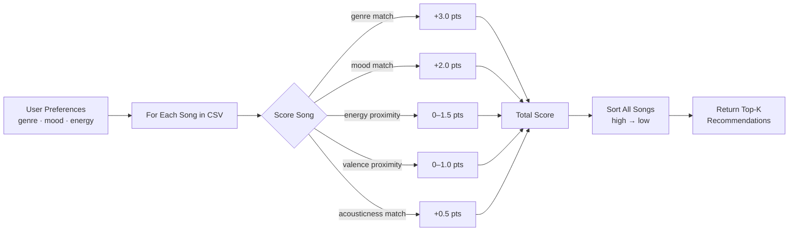
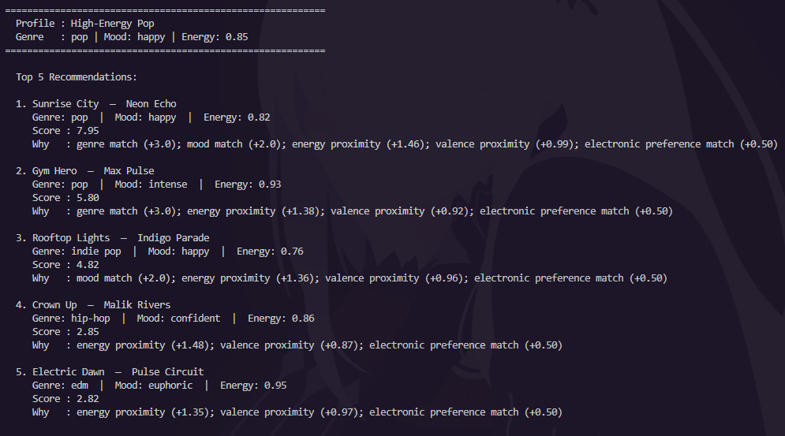
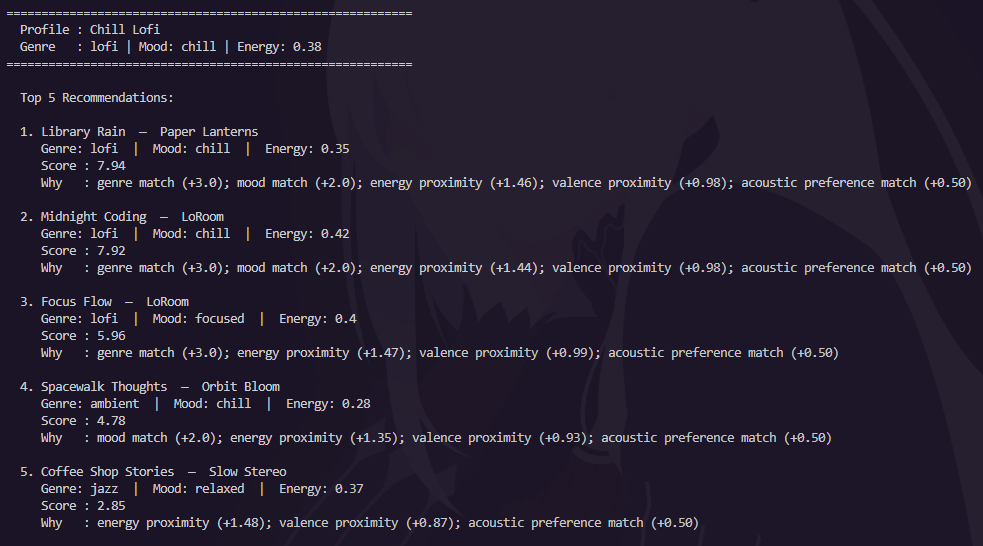
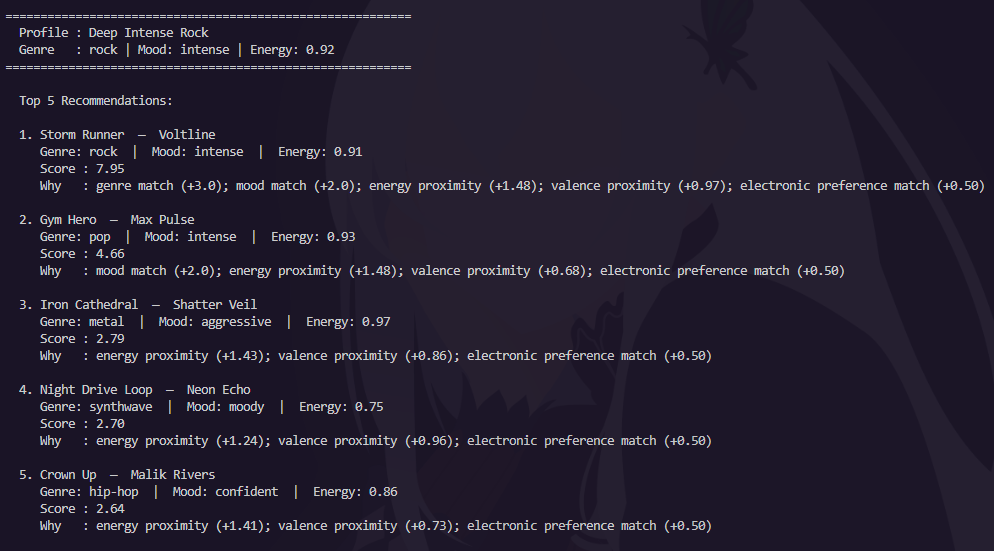
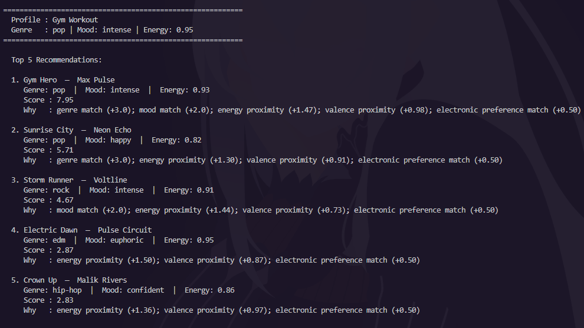
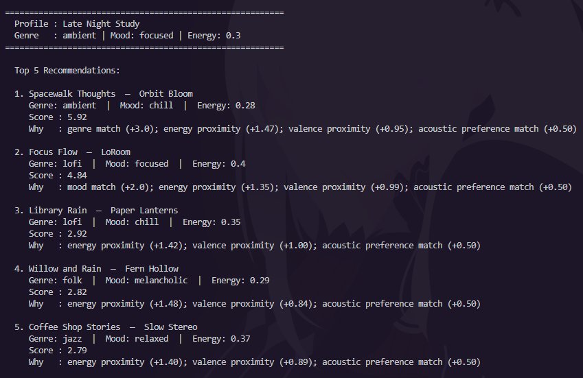
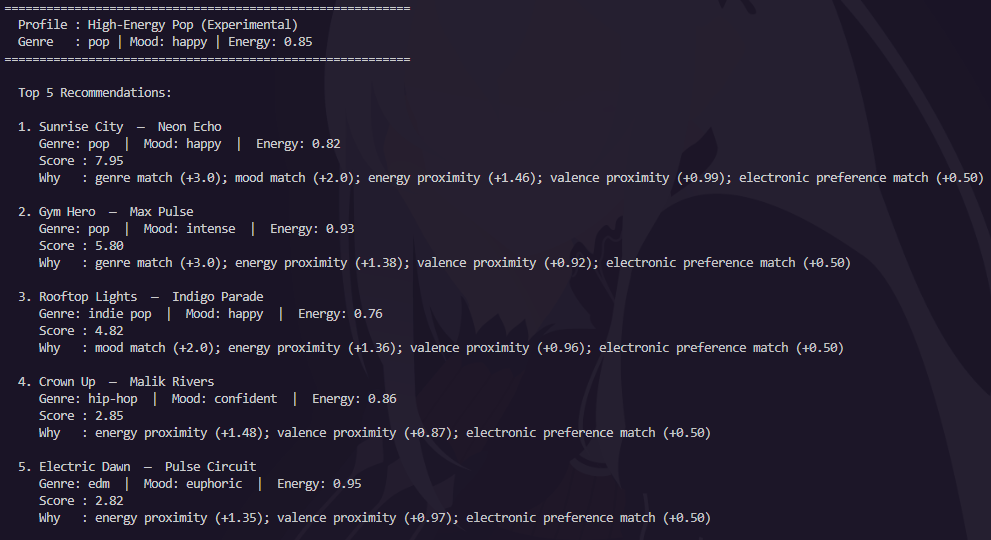

# 🎵 Music Recommender Simulation

## Project Summary

In this project you will build and explain a small music recommender system.

Your goal is to:

- Represent songs and a user "taste profile" as data
- Design a scoring rule that turns that data into recommendations
- Evaluate what your system gets right and wrong
- Reflect on how this mirrors real world AI recommenders

This simulation builds a content-based music recommender that scores songs by comparing their attributes (genre, mood, energy, valence, acousticness) to a user's taste profile. It uses a weighted proximity formula so that songs closest to the user's preferences rank highest, and returns the top-k recommendations with a plain-language explanation for each suggestion.

---

## How The System Works

Real-world music recommenders like Spotify or YouTube use two main strategies: **collaborative filtering**, which looks at what similar users listened to, and **content-based filtering**, which compares the actual attributes of songs to a user's taste profile. Spotify's "Discover Weekly" blends both — it finds users who liked the same tracks as you, then surfaces songs those users enjoyed that you haven't heard yet. At scale, this involves embedding millions of songs and users into vector spaces and finding nearest neighbors. My simulation focuses on the simpler content-based approach: compare each song's features directly to what the user says they like, score every song, and return the top matches.

**Song features used:**

Each `Song` object stores: `genre` (e.g., pop, lofi, rock), `mood` (e.g., happy, chill, intense), `energy` (0–1 scale of loudness/activity), `valence` (0–1 scale of musical positivity), `danceability`, `acousticness` (0–1 scale of acoustic vs. electronic sound), and `tempo_bpm`.

**UserProfile stores:**

The user's `favorite_genre`, `favorite_mood`, `target_energy` (a numeric preference between 0 and 1), and `likes_acoustic` (a boolean that maps to a preferred acousticness range). The functional API also accepts an optional `valence` target.

**Algorithm Recipe — how the recommender scores each song:**

The scoring rule rewards closeness rather than raw magnitude. Categorical features (genre, mood) earn full points for a match and zero for a mismatch. Numeric features use proximity scoring so that a song at exactly the user's preferred value scores maximum points and the score shrinks the further away the song's value is from the target.

| Feature | Match type | Points awarded |
|---|---|---|
| Genre | Exact match | +3.0 |
| Mood | Exact match | +2.0 |
| Energy | Proximity: `1.5 × (1 − |target − song|)` | 0 – 1.5 |
| Valence | Proximity: `1.0 × (1 − |target − song|)` | 0 – 1.0 |
| Acousticness | Preference match | +0.5 |

**Potential bias to watch for:** Genre carries the most weight (3.0), which means a pop user will almost never see a jazz recommendation even if the jazz song is a perfect energy and mood match. This creates a "filter bubble" within genre silos.

**How songs are chosen (Ranking Rule):**

After every song in the catalog receives a score, `sorted()` (non-destructive, returns a new list) sorts them from highest to lowest and returns the top `k` results. Keeping the Scoring Rule (how good is one song?) separate from the Ranking Rule (which songs make the list?) makes it easy to experiment — you can modify scoring weights without touching the sorting logic.

**Mermaid.js data flow:**



---

## Getting Started

### Setup

1. Create a virtual environment (optional but recommended):

   ```bash
   python -m venv .venv
   source .venv/bin/activate      # Mac or Linux
   .venv\Scripts\activate         # Windows
   ```

2. Install dependencies:

   ```bash
   pip install -r requirements.txt
   ```

3. Run the app:

   ```bash
   python -m src.main
   ```

### Running Tests

```bash
pytest
```

---

## Terminal Output

### High-Energy Pop


### Chill Lofi


### Deep Intense Rock


### Gym Workout


### Late Night Study


### Experiment: Weight Shift


---

Below is the same output as plain text for reference:

```
Loaded songs: 18

==========================================================
  Profile : High-Energy Pop
  Genre   : pop | Mood: happy | Energy: 0.85
==========================================================

  Top 5 Recommendations:

  1. Sunrise City  —  Neon Echo
     Genre: pop  |  Mood: happy  |  Energy: 0.82
     Score : 7.95
     Why   : genre match (+3.0); mood match (+2.0); energy proximity (+1.46); valence proximity (+0.99); electronic preference match (+0.50)

  2. Gym Hero  —  Max Pulse
     Genre: pop  |  Mood: intense  |  Energy: 0.93
     Score : 5.80
     Why   : genre match (+3.0); energy proximity (+1.38); valence proximity (+0.92); electronic preference match (+0.50)

  3. Rooftop Lights  —  Indigo Parade
     Genre: indie pop  |  Mood: happy  |  Energy: 0.76
     Score : 4.82
     Why   : mood match (+2.0); energy proximity (+1.36); valence proximity (+0.96); electronic preference match (+0.50)

  4. Crown Up  —  Malik Rivers
     Genre: hip-hop  |  Mood: confident  |  Energy: 0.86
     Score : 2.85
     Why   : energy proximity (+1.48); valence proximity (+0.87); electronic preference match (+0.50)

  5. Electric Dawn  —  Pulse Circuit
     Genre: edm  |  Mood: euphoric  |  Energy: 0.95
     Score : 2.82
     Why   : energy proximity (+1.35); valence proximity (+0.97); electronic preference match (+0.50)


==========================================================
  Profile : Chill Lofi
  Genre   : lofi | Mood: chill | Energy: 0.38
==========================================================

  Top 5 Recommendations:

  1. Library Rain  —  Paper Lanterns
     Genre: lofi  |  Mood: chill  |  Energy: 0.35
     Score : 7.94
     Why   : genre match (+3.0); mood match (+2.0); energy proximity (+1.46); valence proximity (+0.98); acoustic preference match (+0.50)

  2. Midnight Coding  —  LoRoom
     Genre: lofi  |  Mood: chill  |  Energy: 0.42
     Score : 7.92
     Why   : genre match (+3.0); mood match (+2.0); energy proximity (+1.44); valence proximity (+0.98); acoustic preference match (+0.50)

  3. Focus Flow  —  LoRoom
     Genre: lofi  |  Mood: focused  |  Energy: 0.4
     Score : 5.96
     Why   : genre match (+3.0); energy proximity (+1.47); valence proximity (+0.99); acoustic preference match (+0.50)

  4. Spacewalk Thoughts  —  Orbit Bloom
     Genre: ambient  |  Mood: chill  |  Energy: 0.28
     Score : 4.78
     Why   : mood match (+2.0); energy proximity (+1.35); valence proximity (+0.93); acoustic preference match (+0.50)

  5. Coffee Shop Stories  —  Slow Stereo
     Genre: jazz  |  Mood: relaxed  |  Energy: 0.37
     Score : 2.85
     Why   : energy proximity (+1.48); valence proximity (+0.87); acoustic preference match (+0.50)


==========================================================
  Profile : Deep Intense Rock
  Genre   : rock | Mood: intense | Energy: 0.92
==========================================================

  Top 5 Recommendations:

  1. Storm Runner  —  Voltline
     Genre: rock  |  Mood: intense  |  Energy: 0.91
     Score : 7.95
     Why   : genre match (+3.0); mood match (+2.0); energy proximity (+1.48); valence proximity (+0.97); electronic preference match (+0.50)

  2. Gym Hero  —  Max Pulse
     Genre: pop  |  Mood: intense  |  Energy: 0.93
     Score : 4.66
     Why   : mood match (+2.0); energy proximity (+1.48); valence proximity (+0.68); electronic preference match (+0.50)

  3. Iron Cathedral  —  Shatter Veil
     Genre: metal  |  Mood: aggressive  |  Energy: 0.97
     Score : 2.79
     Why   : energy proximity (+1.43); valence proximity (+0.86); electronic preference match (+0.50)

  4. Night Drive Loop  —  Neon Echo
     Genre: synthwave  |  Mood: moody  |  Energy: 0.75
     Score : 2.70
     Why   : energy proximity (+1.24); valence proximity (+0.96); electronic preference match (+0.50)

  5. Crown Up  —  Malik Rivers
     Genre: hip-hop  |  Mood: confident  |  Energy: 0.86
     Score : 2.64
     Why   : energy proximity (+1.41); valence proximity (+0.73); electronic preference match (+0.50)


==========================================================
  Profile : Gym Workout
  Genre   : pop | Mood: intense | Energy: 0.95
==========================================================

  Top 5 Recommendations:

  1. Gym Hero  —  Max Pulse
     Genre: pop  |  Mood: intense  |  Energy: 0.93
     Score : 7.95
     Why   : genre match (+3.0); mood match (+2.0); energy proximity (+1.47); valence proximity (+0.98); electronic preference match (+0.50)

  2. Sunrise City  —  Neon Echo
     Genre: pop  |  Mood: happy  |  Energy: 0.82
     Score : 5.71
     Why   : genre match (+3.0); energy proximity (+1.30); valence proximity (+0.91); electronic preference match (+0.50)

  3. Storm Runner  —  Voltline
     Genre: rock  |  Mood: intense  |  Energy: 0.91
     Score : 4.67
     Why   : mood match (+2.0); energy proximity (+1.44); valence proximity (+0.73); electronic preference match (+0.50)

  4. Electric Dawn  —  Pulse Circuit
     Genre: edm  |  Mood: euphoric  |  Energy: 0.95
     Score : 2.87
     Why   : energy proximity (+1.50); valence proximity (+0.87); electronic preference match (+0.50)

  5. Crown Up  —  Malik Rivers
     Genre: hip-hop  |  Mood: confident  |  Energy: 0.86
     Score : 2.83
     Why   : energy proximity (+1.36); valence proximity (+0.97); electronic preference match (+0.50)


==========================================================
  Profile : Late Night Study
  Genre   : ambient | Mood: focused | Energy: 0.3
==========================================================

  Top 5 Recommendations:

  1. Spacewalk Thoughts  —  Orbit Bloom
     Genre: ambient  |  Mood: chill  |  Energy: 0.28
     Score : 5.92
     Why   : genre match (+3.0); energy proximity (+1.47); valence proximity (+0.95); acoustic preference match (+0.50)

  2. Focus Flow  —  LoRoom
     Genre: lofi  |  Mood: focused  |  Energy: 0.4
     Score : 4.84
     Why   : mood match (+2.0); energy proximity (+1.35); valence proximity (+0.99); acoustic preference match (+0.50)

  3. Library Rain  —  Paper Lanterns
     Genre: lofi  |  Mood: chill  |  Energy: 0.35
     Score : 2.92
     Why   : energy proximity (+1.42); valence proximity (+1.00); acoustic preference match (+0.50)

  4. Willow and Rain  —  Fern Hollow
     Genre: folk  |  Mood: melancholic  |  Energy: 0.29
     Score : 2.82
     Why   : energy proximity (+1.48); valence proximity (+0.84); acoustic preference match (+0.50)

  5. Coffee Shop Stories  —  Slow Stereo
     Genre: jazz  |  Mood: relaxed  |  Energy: 0.37
     Score : 2.79
     Why   : energy proximity (+1.40); valence proximity (+0.89); acoustic preference match (+0.50)
```

---

## Experiments You Tried

**Experiment 1 — Weight Shift (Double energy, halve genre)**

Changed genre weight from 3.0 → 1.5 and energy weight from 1.5 → 3.0 for the High-Energy Pop profile. Results:

| Rank | Baseline | Experimental |
|------|----------|-------------|
| 1 | Sunrise City (7.95) | Sunrise City (7.90) |
| 2 | Gym Hero (5.80) | Rooftop Lights (6.19) |
| 3 | Rooftop Lights (4.82) | Gym Hero (5.68) |
| 4 | Crown Up (2.85) | Crown Up (4.34) |
| 5 | Electric Dawn (2.82) | Electric Dawn (4.17) |

Rooftop Lights jumped from #3 to #2 because it has a mood match (happy) and very close energy, which became worth more. Gym Hero dropped because it only matches genre, and that bonus shrank. This shows how sensitive the middle rankings are to weight choices. The top result (Sunrise City) was stable because it matches on all features simultaneously.

**Experiment 2 — Adversarial Profile: Conflicting Preferences**

Tested a profile with `energy: 0.9` (very intense) and `mood: sad` (not present in catalog at all). Result: the system fell back entirely on energy proximity, since no song had a "sad" mood. The top results were Iron Cathedral, Electric Dawn, and Gym Hero — all high-energy. The absence of a mood match was invisible to the user in the output unless they read the "Why" explanations carefully. This is a real usability flaw.

---

## Limitations and Risks

- The catalog is tiny (18 songs). Genre diversity is limited, especially for newer or niche genres.
- The genre-dominance problem: a genre match at 3.0 points overwhelms nearly every other signal. Users exploring outside their genre will almost never see cross-genre suggestions.
- The system has no memory — it cannot adapt based on what a user has already heard or skipped.
- Mood labels are categorical and fixed. A song labeled "chill" and a song labeled "relaxed" are treated as completely different even though they feel very similar.
- No lyrics, language, or cultural context is considered.

See `model_card.md` for a deeper discussion of limitations and bias.

---

## Reflection

Read and complete `model_card.md`:

[**Model Card**](model_card.md)

The most important thing I learned from this project is that the weight choices in a simple recommender are not neutral — they encode assumptions about what matters to users. By setting genre at 3.0 points, I was implicitly saying "genre is more important than mood, energy, and acousticness combined." That might be true for some people and completely wrong for others. Real platforms solve this by learning weights from user behavior data, but that introduces its own biases (toward mainstream tastes, toward engagement over satisfaction).

I was also surprised by how "smart" the system could feel with only five features. When the profile closely matches songs in the catalog (like Chill Lofi or High-Energy Pop), the top results are genuinely reasonable suggestions. The recommendations feel like they understand the user — even though the underlying logic is just arithmetic. This is a good reminder that "feels intelligent" and "is intelligent" are not the same thing, and that transparency (the "Why" explanation output) matters a lot for helping users understand and trust what an algorithm is doing.

---

## Reflection on AI Tool Use

I used AI assistance throughout this project to structure the scoring formula, generate diverse song entries for the CSV, brainstorm edge-case profiles, and think through potential biases. The tools were most helpful when I gave them specific constraints — for example, asking for songs that represent genres not already in the dataset, or asking for a critique of whether my user profile could distinguish between "intense rock" and "chill lofi" at the same time. I needed to double-check suggestions against the actual catalog and run the code to see whether the recommendations felt right, since the AI could suggest plausible-sounding weights without verifying they produced good results on real data.

