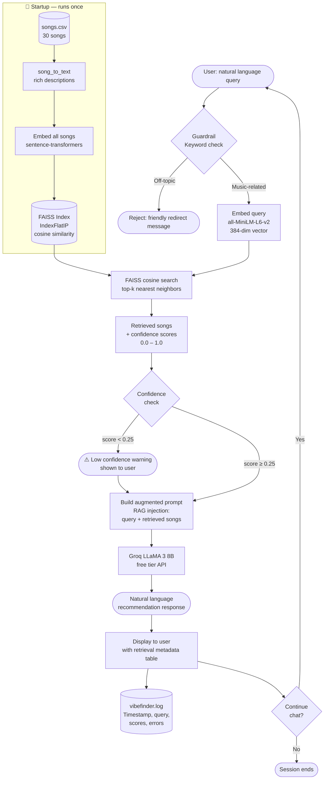

# VibeFinder 2.0 — System Architecture Diagram

## Full RAG Pipeline



---

## Component Summary

| Component | Technology | Purpose |
|---|---|---|
| **Guardrail** | Keyword set + regex | Block off-topic queries before LLM call |
| **Query Embedder** | sentence-transformers `all-MiniLM-L6-v2` | Map user query to 384-dim semantic vector |
| **Song Catalog** | `data/songs.csv` (30 songs) | Ground truth database for recommendations |
| **song_to_text** | Custom Python function | Converts song metadata to descriptive English text |
| **FAISS Index** | `faiss-cpu IndexFlatIP` | Fast cosine similarity search over song embeddings |
| **Confidence Score** | Cosine similarity (0–1) | Retrieval quality signal; warns user on low scores |
| **Prompt Builder** | String templating | Injects retrieved songs into LLM prompt (RAG) |
| **LLM Generator** | Groq LLaMA 3 8B (free) | Generates grounded natural-language recommendations |
| **Logger** | Python `logging` module | Records all queries, scores, and errors to file |
| **Test Harness** | Custom Python script | Automated pass/fail evaluation of 12 test cases |

---

## Data Flow Summary

```
User input (string)
  → Guardrail (keyword filter)
  → Embedding (float32 vector, shape [1, 384])
  → FAISS search (cosine similarity over [30, 384] index)
  → Retrieved songs (list of dicts) + scores (list of floats)
  → Augmented prompt (string with song context injected)
  → Groq API (chat completion, max 600 tokens)
  → Response text (string)
  → Display + logging
```

---

## How RAG Prevents Hallucination

Without RAG, the LLM would generate recommendations from its training data. This
leads to:
- Made-up song titles that sound plausible but don't exist
- Real songs that exist but aren't in the catalog
- Inconsistent quality depending on what the model "remembers"

With RAG, the prompt explicitly contains the songs the LLM is allowed to reference.
The LLM acts as a *writer* that explains songs it has been *given*, not a *memory*
that recalls songs it *learned about*. This is the core value proposition of RAG.
